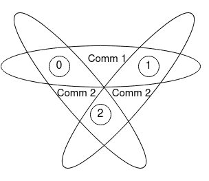

The Basic MPI calls
-----------------------

.. admonition:: Overview
    :class: Overview

    * **Tutorial:** 20 min

        **Objectives:**
            #. Learn six monstly used MPI calls.

MPI can be very easy to use. If your code only needs simple communication patterns, such as point-to-point communication, you can get by with just six MPI calls. These six calls are:

1. **MPI_Init:** Initializes the MPI environment.
2. **MPI_Comm_size:** Returns the total number of processes in a communicator.
3. **MPI_Comm_rank:** Returns the rank of the calling process in a communicator.
4. **MPI_Send:** Sends a message to a specific process.
5. **MPI_Recv:** Receives a message from a specific process.
6. **MPI_Finalize:** Terminates the MPI environment.

.. admonition:: Key MPI call
    :class: hint

    MPI_INIT()

    C Binding:

    .. code-block:: c

        int MPI_Init(int &argc, char &argv)

.. note::
    
    #. **The MPI_Init()** call does not create a process; rather, it initialises the MPI environment, e.g. defines the initial communicator MPI_WORLD_COMM.
    
    #. It must be called before any other MPI function.

Communicator
~~~~~~~~~~~~~~~~~~~
As we saw in the our first MPI call **MPI_Init()**, MPI uses a communicator to define a group of processes that can communicate with each other. 

.. note::
    #. The communicator defines the group of processes for communication.
    #. A communicator must be specified in MPI program as a unit of communication. The default communicator is **MPI_COMM_WORLD**, which includes all processes.
    #. Multiple communicators can be defined, either overlapping or non-overlapping.

