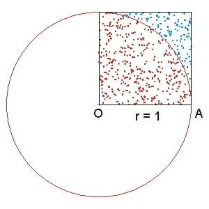

Example: Monte-carlo Approximation of Pi
------------------

.. admonition:: Overview
    :class: Overview

    * **Tutorial:** 20 min

        **Objectives:**
            #. Learn how to use MPI to approximate Pi using the Monte Carlo method.

**Monte Carlo Method:** The Monte Carlo method is a statistical technique used to estimate the value of an unknown quantity using random sampling. It is widely used in various fields, including physics, finance, and computer science, to solve problems that may be deterministic in principle but are too complex to solve analytically.

