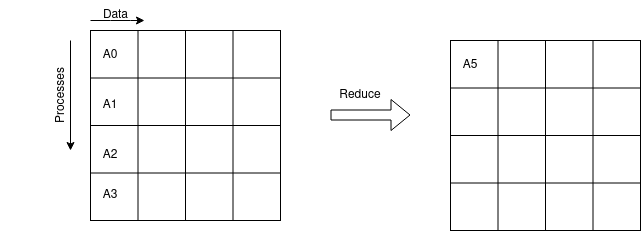
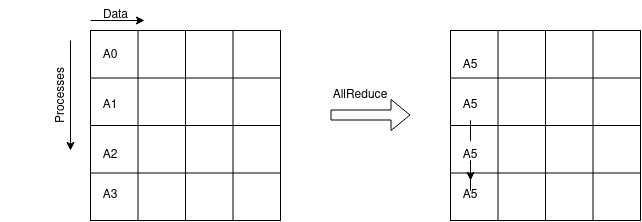

One-sided Communication 
----------------------------

The final communication category we will discuss is one-sided communication. In one-sided communication, one process can read or write to the memory of another process without the need for the other process to participate in the communication. This is in contrast to two-sided communication, where both processes must participate in the communication. One-sided communication is useful when the communication pattern is such that one process needs to access the memory of another process, but the other process does not need to access the memory of the first process. This can be useful in many applications, such as when one process needs to update a shared data structure, or when one process needs to read data from another process. One-sided communication can be more efficient than two-sided communication in some cases, because it can reduce the amount of synchronization required between processes. However, one-sided communication can also be more difficult to use than two-sided communication, because it requires careful management of memory access and synchronization. In this section, we will discuss the basics of one-sided communication in MPI, including the MPI_Win_create, MPI_Win_fence, MPI_Put, and MPI_Get functions.

.. admonition:: Definition

    **All to All** All processes contribute to the result. All processes receive the result.

    **All to One** All processes contribute to the result. One process receives the result.

    **All to One** One process contributes to the result. All processes receive the result.

In our example, we need the collective communications for quantities such as the averaging the errors, or the max or min of the function values defined over the domain.

One to all Communication
=========================

**MPI_BCAST**
MPI_BCAST broadcasts a message from the process with rank "root" to all other processes of the communicator, as shown in the figure below.

.. image:: ../../figures/bcast.png

In this diagram, each row of the box represents data location in one process. Initially only the first process contain the data A0, after the MPI_BCAST call, all processes contain the data A0.

.. admonition:: Key MPI call
    :class: hint

    MPI_BCAST(buffer, count, datatype, root, comm)
        INOUT **buffer**: initial address of send buffer (choice)
        IN **count**: number of elements in send buffer (non-negative integer)
        IN **datatype**: data type of elements in send buffer (handle)
        IN **root**: rank of broadcast root (integer)
        IN **comm**: communicator (handle)
    
    C Binding:

    .. code-block:: c

        // broadcast a message from the process with rank "root" to all other processes of the communicator
        int MPI_Bcast(void *buffer, int count, MPI_Datatype datatype, int root, MPI_Comm comm)

All to One Communication
=========================

**MPI_REDUCE**
MPI_REDUCE combines the data from all processes, operate on them by a predefined operator, and returns the result to one process. The figure below shows the operation of MPI_REDUCE.

In the diagram above, a global reduce operation performs across all members of the communication group, and returns the result of the reduction to one member of the group.

.. admonition:: Key MPI call
    :class: hint

    MPI_REDUCE(sendbuf, recvbuf, count, datatype, op, root, comm)
        IN **sendbuf**: address of send buffer (choice)
        OUT **recvbuf**: address of receive buffer (choice, significant only at root)
        IN **count**: number of elements in send buffer (non-negative integer)
        IN **datatype**: data type of elements in send buffer (handle)
        IN **op**: operation (handle)
        IN **root**: rank of root process (integer)
        IN **comm**: communicator (handle)
   
   
    C Binding:

    .. code-block:: c

        // combine the data from all processes, operate on them by a predefined operator, and return the result to one process
        int MPI_Reduce(void *sendbuf, void *recvbuf, int count, MPI_Datatype datatype, MPI_Op op, int root, MPI_Comm comm)

In our example, we use `MPI_REDUCE` to calculate the global l2 residual.

.. code-block:: c

        /* get local residual from each process */
        double residual, tot_res;
        residual  = local_l2_residual(ptr_rows, mesh_size, space, &submesh[0][0], \
        subrhs[0][0]);
    
        /* sum res from all processes and calculate l2 norm */
        MPI_Reduce(&residual, &tot_res, 1, MPI_DOUBLE, MPI_SUM, 0, MPI_COMM_WORLD);
        if (rank == 0){
            tot_res = sqrt(tot_res);
            printf("Residual1  %f\n",  tot_res); 
            }

.. note::
    MPI standard provides a set of predefined operators.

    1. MPI_MAX: maximum
    2. MPI_MIN: minimum
    3. MPI_SUM: sum
    4. MPI_PROD: product
    5. MPI_MAXLOC: max value and location
    6. MPI_MINLOC: min value and location
    7. and a few more bit-wise operators
    User-defined reduction operations are also possible.

All to All Communication
=========================

**MPI_ALLREDUCE**
`MPI_ALLREDUCE`` is similar to MPI_REDUCE, but the result is returned to all processes. 
Effectively, it is the same as `MPI_REDUCE` + `MPI_BCAST`.  The figure below shows the operation of `MPI_ALLREDUCE`.

.. admonition:: Key MPI call
    :class: hint

    MPI_ALLREDUCE(sendbuf, recvbuf, count, datatype, op, comm)
        IN **sendbuf**: address of send buffer (choice)
        OUT **recvbuf**: address of receive buffer (choice)
        IN **count**: number of elements in send buffer (non-negative integer)
        IN **datatype**: data type of elements in send buffer (handle)
        IN **op**: operation (handle)
        IN **comm**: communicator (handle)
    C Binding:

.. code-block:: c
    
    // combine the data from all processes, operate on them by a predefined operator, and return the result to all processes
    int MPI_Allreduce(void *sendbuf, void *recvbuf, int count, MPI_Datatype datatype, MPI_Op op, MPI_Comm comm)

.. admonition:: Remark
    :class: hint

    #. The collective communication procedures `MPI_REDUCE`, `MPI_ALLREDUCE`, `MPI_BCAST` are blocking operations.
    
    #. There are corresponding non-blocking procedures for each of them following the same deinition of the nonblocking operation that we discussed before.

    #. There are also corresponding persistent procedures for each of them following the same definition of the persistent operation that we discussed before.

