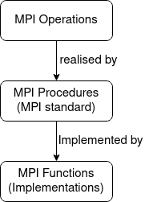

MPI Semantics
---------------

.. admonition:: Overview
   :class: Overview

    * **Tutorial:** 20 min

        **Objectives:**
            #. Learn the semantics of MPI.

To help us understand and better use MPI, we get into the details of its semantics. Fair warning ahead, this is a bit of a dry topic and it does get tedious. You can skip this section if you just want pick up MPI functions and use them straightaway, but recommend you to go through this section to acquire a more in-depth understanding of MPI.

We discuss the semantics of MPI with the structure illustrated in the following diagram:

MPI Operations
----------------
First, we introduce the concept of MPI operations.

.. admonition:: Definition
    :class: hint

    An **MPI operation** is a sequence of steps performed by the MPI library to establish and enable data transfer and/or synchronishation. It consists of four stages: **initialisation**, **starting**, **completion**, and **freeing**. An MPI operation is implemented as a set of one or more MPI procedures. 

The main MPI opeartions are: **Blocking Operations**, **Non-blocking Operations**, **Collective Operations**, and **Persistent Operations**. We will discuss each of these in detail in the upcoming sections.

.. note::
    An MPI operation describes the property of a class of data transfer mechanism but does not define a unique MPI procedure.

The four stages of an MPI operation are:

1. **initialisation**: Hands over the argument list to the operation but not the content of the data buffers.
2. **starting**: Hands over the control of the data buffers, if any, to the associated operation.
3. **completion**: Returns control of the content of the data buffers and indicates that output buffers and arguments, if any, have been updated.
4. **freeing**: Returns control of the rest of the argument list.

We can apply these stages to define the four aforementioned MPI operations.

.. admonition:: Definition
    ::class: hint
    A **blocking operation** is when the four stages are combined into a single procedure call.

MPI Procedures
----------------
, we introduce the concept of MPI procedures.

.. admonition:: Definition
    :class: hint

    An **MPI procedure** describes functionalities and are specified using a language-independent notation. 