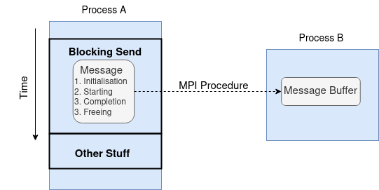
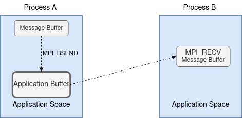
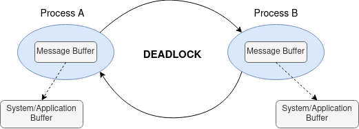
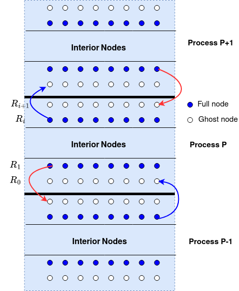
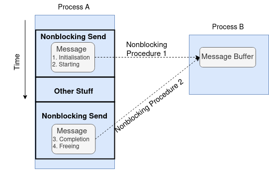

Point-to-point Communication 
----------------------------

The point-to-point communication is the most original form of communication in MPI. It's when process A wants to send a message to process B. So what is a message?

.. admonition:: Definition

    In MPI, a **message** is **message data** + **message envelope**.
    
.. admonition:: Definition

    The **message data** is made of three components: (address, count, datatype).

    **address**: the beginning address of the data buffer.

    **count**: the number of successive entries of the type specified by datatype.

    **datatype**: the MPI datatype of the data.

.. admonition:: Definition

    The **message envelope** is made of four components: (source, destination, tag, communicator).

    **source**: the rank of the sending MPI process.

    **destination**: the rank of the receiving MPI process.

    **tag**: a message identifier.

    **communicator**: the communicator over which the message is sent.

.. admonition:: Remark

    1. The **datatype** is a predefined name to specify machine-independent data elements. The basic datatypes are `MPI_INT`, `MPI_DOUBLE` (in C); `MPI_INTEGER`, `MPI_REAL` (in Fortran).
    MPI always provides derived datatypes which are user-defined mix of basic datatypes.
    The rational for MPI datatype is to support communications between machines with different memory representations.

    2. The **tag** is a message identifier that allows the receiver to distinguish between different messages from the same source.

    3. The **communicator** specifies a 'communication universe'. Messages are always received within the 'communication universe' they were sent, and messages sent in different 'communication universe' do not interfere. For example, `MPI_COMM_WORLD` is a specifies the communication within all processes available at initialization time.

In our model problem, we need to send the nodal values of the second bottom row to the neighbouring processor's top boundary row; as shown in the figure below:

.. image:: ../../figures/Submesh.png

Processor A updates its row $R_i$ to processor B's row $R_i$. This can be done by `MPI_Send`

.. code-block:: c 

    MPI_Send(submesh[1], mesh_size, MPI_DOUBLE, lower, lowertag, MPI_COMM_WORLD);

In this line of code, the data buffer starts at `submesh[1]`, the number of elements is `mesh_size`, the datatype is `MPI_DOUBLE`, the destination is `lower`, the tag is `lowertag`, and the communicator is `MPI_COMM_WORLD`.

Topic 2A: Blocking Communication
--------------------------------

We have shown how a message is sent through `MPI_Send`. The block SEND-RECV is the basic MPI communication mechanism.
Recall the blocking operation has all four stages packed into a single procedure.

This diagram implies that the corresponding MPI procedure does not return until the message data and envelope have been safely stored away so that the sender is free to modify the sender buffer.

.. admonition:: Remark

    For the blocking send operation, the message might be sent directly into the matching receiver's buffer or it might be copied into a temporary system buffer. MPI offers the following communication modes for users to choose how they want to complete the blocking send operation.

    #. **Standard Send**

    #. **Buffered Send**

    #. **Synchronous Send**

    #. **Ready Send**

    Why there four different modes for the blocking send operation? The reason is that the different modes offer different trade-offs between the cost of buffering and the cost of communication. The cost of buffering is the cost of allocating memory for buffering, the cost of communication is due to the latency of the communication, as shown in the figure below.

    .. image:: ../../figures/MPI_Send_delay.png

    In this diagram, the **synchronous send** is used to send message from Process A to Process B. However, Process B has a lot of other stuff to do before it can be ready to receive the message. The **synchronous send** will block Process A not only until Process B is ready to receive the message but the message is posted. 

    **`MPI_SEND`(Standard mode)**
    The standard mode of MPI blocking send operation is the widely used `MPI_SEND`. 
    This mode will either buffer the outgoing data or sends to the matching receiver's buffer - up to the particular MPI implementation to decide. In the diagram below, we use the dash line to indicate the possible route for sending the data in this mode.

    .. image:: ../../figures/Standard_send.png

.. admonition:: Key MPI call
    :class: hint

    MPI_SEND(buf, count, datatype, dest, tag, comm)
        IN **buf**: starting address of buffer (choice)

        IN **count**: number of entries in buffer (non-negative integer)

        IN **datatype**: datatype of elements in send buffer (handle)

        IN **dest**: rank of destination (integer)

        IN **tag**: message tag (integer)

        IN **comm**: communicator (handle)

    C Binding:

    .. code-block:: c

        // bug message is sent from the calling rank to dest rank
        int MPI_Send(const void *buf, int count, MPI_Datatype datatype, int dest, int tag, MPI_Comm comm);

.. admonition:: Key Points
    :class: hint

    #. Blocking operations implies that neither the send buffer nor the argument list can be modified until the buffer is safely stored away.

    #. System buffer may be outside the application space.

    #. How system buffer is chosen is up to particular MPI implementations.

    #. Eager protocol - small messages

    #. Rendezvous protocol - large messages

    #. It may complete before the matching RECV is posted.

**`MPI_BSEND`(Buffered mode)**

The buffer mode buffers the message to the application buffer provided by the user.

.. admonition:: Key MPI call
    :class: hint

    #. Users are responsible for providing enough space for buffer.

    #. The buffer is allowcated by `MPI_Buffer_attach` and deallocated by `MPI_Buffer_detach`.

    #. Only one buffer is allowed in a process at a time.

    #. The implementation varies.

    #. The buffer management makes it error-prone.

.. admonition:: Key MPI call
    :class: hint

    MPI_BSEND(buf, count, datatype, dest, tag, comm)
        IN **buf**: starting address of buffer (choice)

        IN **count**: number of entries in buffer (non-negative integer)

        IN **datatype**: datatype of elements in send buffer (handle)

        IN **dest**: rank of destination (integer)

        IN **tag**: message tag (integer)

        IN **comm**: communicator (handle)

   .. code-block:: c

    // bug message is sent from the calling rank to dest rank
    int MPI_Bsend(const void *buf, int count, MPI_Datatype datatype, int dest, int tag, MPI_Comm comm);

**`MPI_SSEND`(Synchronous mode)**

The synchronous mode completes only if a matching receive is posted, and the receiver has started to receive the message date.

.. admonition:: Key MPI call
    :class: hint

    #. It implies that the sender has to hold until a matching receive is posted, and the receiver has started to receive the message before continuing.

    #. It also ensures both processes have reached a certain point in the execution.

    #. A standard send can be implemented as a synchronous send.

The `MPI_SSEND` syntax is the same as `MPI_SEND`.

The read mode `MPI_RSEND` is not discussed here. It is rarely used in practice.

The subtle difference between the different modes can be seen in the figure below.

In this diagram, the message sent by each process has to be copied out before the send operation returns and the receive operation starts. 
For the program to complete, it is necessary for at least one of the two messages sent be buffered. 
Thus, this program can succeed only if the communication system can buffer the message data. 
Otherwise, the program will deadlock.

**`MPI_RECV`**
Next we will talk about the blocking receive operation.
In MPI, SEND and RECV are asymmetric operations. The sender initiates the communication, and the receiver waits for the message to arrive.
A receiver may accept messages from an arbitrary sender, but the sender must specify a unique reciver.
The length of the RECV buffer can also be equal to or greater than the length of the SEND message.
Finally, unlike the different modes of blocking send operation, there is only one RECV procedure but it mathces all of the send modes.

.. admonition:: Key MPI call
    :class: hint

    MPI_RECV(buf, count, datatype, source, tag, comm, status)
        IN **buf**: starting address of buffer (choice)

        IN **count**: number of entries in buffer (non-negative integer)

        IN **datatype**: datatype of elements in send buffer (handle)

        IN **source**: rank of source or `MPI_ANY_SOURCE` (integer)

        IN **tag**: message tag or `MPI_ANY_TAG` (integer)

        IN **comm**: communicator (handle)

        OUT **status** status object (status) 

    .. code-block:: c

        // bug message is received at the calling rank 
        int MPI_Recv(void *buf, int count, MPI_Datatype datatype, int source, int tag, MPI_Comm comm, MPI_Status *status);

.. note::

    The `MPI_Status` object is used to store information about the received message, such as the source, tag, and number of elements received. It is optional to use the `MPI_Status` object, but it is useful for debugging and error checking. In C, the `MPI_Status` object is a structure that contains the following fields: `MPI_SOURCE`, `MPI_TAG`, `MPI_ERROR`, and in Fortran, it is an array of integers.

**Model Problem**
Now we apply the SEND and RECV operations to our model problems. 
Focusing on each process, we can see that the process sends the second top and second bottom rows to the neighbouring processes, and receives updates on the top and bottom rows from the neighbouring processes; as shown in the figure below:

In this diagram, each process sends two outgoing messages and receives tow incoming messages. To distinguish them, we use different upper tag and lower tag for the messages.

.. admonition:: Exercise
    :class: hint

    In laplace_mpi_blocking.c, complete the communication by writing blocking SEND and RECE using MPI_SEND and MPR_RECV.

Topic 2D: Nonblocking Communication
-----------------------------------

Since the network speed is much slower than floating-point operations, time spent on waiting for completing the matching SEND and RECV in blocking operations can be used for computation. 
This is realised by nonblocking operations. 
Recall the nonblocking opeaxrtion packs **initialisation** and **starting** stages into one MPI procedure and **completion** and **freeing** stages into a separate procedure, as shown in the following diagram:

This allows the sender to continue computation just after handing over the control of data buffer. 
The first nonblocking SEND procedure is `MPI_ISEND`.

.. admonition:: Key MPI call
    :class: hint

    MPI_ISEND(buf, count, datatype, dest, tag, comm, request)
        IN **buf**: starting address of buffer (choice)

        IN **count**: number of entries in buffer (non-negative integer)

        IN **datatype**: datatype of elements in send buffer (handle)

        IN **dest**: rank of destination (integer)

        IN **tag**: message tag or `MPI_ANY_TAG` (integer)

        IN **comm**: communicator (handle)

        OUT **request**: communication request (handle)

    .. code-block:: c

        //buffer msg is sent from the calling rank to dest rank
        int MPI_Isend(const void *buf, int count, MPI_Datatype datatype, int dest, int tag, MPI_Comm comm, MPI_Request *request);

The nonblocking SEND operation has the same communication modes as the blocking SEND operation, i.e., `MPI_Isend`, `MPI_IBSEND`, `MPI_ISSEND`, and `MPI_IRSEND`. We will not discuss them here.

All arguments are the same as in `MPI_SEND` except the additional `request` argument in the nonblocking SEND operation. 
The `request` is an opaque object used to identify communication operations and match the operation that initiates the communication with the operation that completes it.
In other words, the `request` is used to track the progress of the communication operation and is used in the second nonblocking procedure to complete the communication.

The second nonblocking procedure is usually realised by `MPI_WAIT`.

.. admonition:: Key MPI call
    :class: hint

    MPI_WAIT(request, status)
        INOUT **request**:  communication request (handle)

        OUT **status**: status object (status)

    .. code-block:: c

        // wait for the completion of a nonblocking operation
        int MPI_Wait(MPI_Request *request, MPI_Status *status);

In our code, we will also use `MPI_Waitall` to wait for both top row and bottom row nonblocking communications to complete.

.. admonition:: Key MPI call
    :class: hint

    MPI_WAITALL(count, array_of_requests, array_of_statuses)
        IN **count**: list length (non-negative integer)

        INOUT **array_of_requests**: array of requests (array of handles)

        OUT **array_of_statuses**: array of status objects (array of status)

    .. code-block:: c

        // wait for all nonblocking operations to complete
        int MPI_Waitall(int count, MPI_Request array_of_requests[], MPI_Status array_of_statuses[]);

    
However, we may want to just check if a communication operation is completed rather than waiting for it to complete.
`MPI_TEST` is used for this purpose.

.. admonition:: Key MPI call
    :class: hint

    MPI_TEST(request, flag, status)
        INOUT **request**: communication request (handle)

        OUT **flag**: true if the operation is complete, false otherwise (logical)

        OUT **status**: status object (status)

    .. code-block:: c

        // test for the completion of a nonblocking operation
        int MPI_Test(MPI_Request *request, int *flag, MPI_Status *status);

Similarly, it can test multiple communication request at once by `MPI_Testall`.

.. admonition:: Key MPI call
    :class: hint

    MPI_TESTALL(count, array_of_requests, flag, array_of_statuses)
        IN **count**: list length (non-negative integer)

        INOUT **array_of_requests**: array of requests (array of handles)

        OUT **flag**: true if all operations are complete(logical)    

        OUT **array_of_statuses**: array of status objects (array of status)    