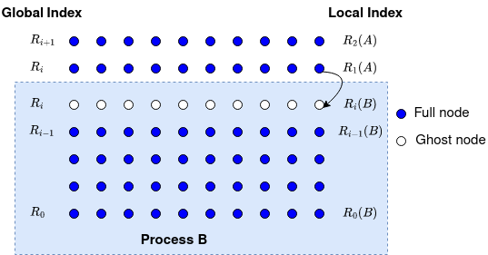

Point-to-point Communication 
----------------------------

The point-to-point communication is the most original form of communication in MPI. It's when process A wants to send a message to process B. So what is a message?

.. admonition:: Definition

    In MPI, a **message** is **message data** + **message envelope**.
    
.. admonition:: Definition

    The **message data** is made of three components: (address, count, datatype).
    **address**: the beginning address of the data buffer.
    **count**: the number of successive entries of the type specified by datatype.
    **datatype**: the MPI datatype of the data.

.. admonition:: Definition

    The **message envelope** is made of four components: (source, destination, tag, communicator).
    **source**: the rank of the sending MPI process.
    **destination**: the rank of the receiving MPI process.
    **tag**: a message identifier.
    **communicator**: the communicator over which the message is sent.

.. admonition:: Remark

    #. The **datatype** is a predefined name to specify machine-independent data elements. The basic datatypes are `MPI_INT`, `MPI_DOUBLE`(in C); MPI_INTEGER, MPI_REAL (in Fortran).
    MPI always provides derived datatypes which are user-defined mix of basic datatypes.
    The rational for MPI datatype is to support communications between machines with different memory representations.
    #. The **tag** is a message identifier that allows the receiver to distinguish between different messages from the same source.
    #. The **communicator** specifies a 'communication universe'. Messages are always received within the 'communication universe' they were sent, and messages sent in different 'communication universe' do not interfere. For example, `MPI_COMM_WORLD` is a specifies the communication within all processes available at initialization time.

In our model problem, we need to send the nodal values of the second bottom row to the neighouring processor's top boundary row; as shown in the figure below:

Processor A updates its row $R_i$ to processor B's row $R_i$. This can be done by `MPI_Send`

.. code-block:: c 

    MPI_Send(submesh[1], mesh_size, MPI_DOUBLE, lower, lowertag, MPI_COMM_WORLD);

In this line of code, the data buffer starts at `submesh[1]`, the number of elements is `mesh_size`, the datatype is `MPI_DOUBLE`, the destination is `lower`, the tag is `lowertag`, and the communicator is `MPI_COMM_WORLD`.

Topic 1A: Blocking Communication
--------------------------------

We have shown how a message is sent through `MPI_Send`. The block SEND-RECV is the basic MPI communication mechanism.
Recall the blocking operation has all four stages packed into a single procedure.

.. image:: ../../figures/Block_Send.png

This diagram implies that the corresponding MPI procedure does not return until the message data and envelope have been safely stored away so that the sender is free to modify the sender buffer.

.. admonition:: Remark

    For the blocking send operation, the message might be sent directly into the matching receiver's buffer or it might be copied into a temporary system buffer. MPI offers the following communication modes for users to choose how they want to complete the blocking send operation.

    #. **Standard Send**
    #. **Buffered Send**
    #. **Synchronous Send**
    #. **Ready Send**

    Why there four different modes for the blocking send operation? The reason is that the different modes offer different trade-offs between the cost of buffering and the cost of communication. The cost of buffering is the cost of allocating memory for buffering, the cost of communication is due to the latency of the communication, as shown in the figure below.

    .. image:: ../../figures/MPI_Send_delay.png

    In this diagram, the **synchronous send** is used to send message from Process A to Process B. However, Process B has lot of other stuff to do before it can be ready to receive the message. The **synchronous send** will block Process A not only until Process B is ready to receive the message but the message is posted. 